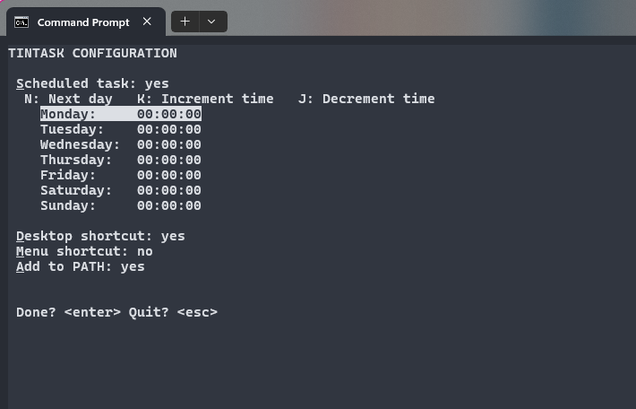
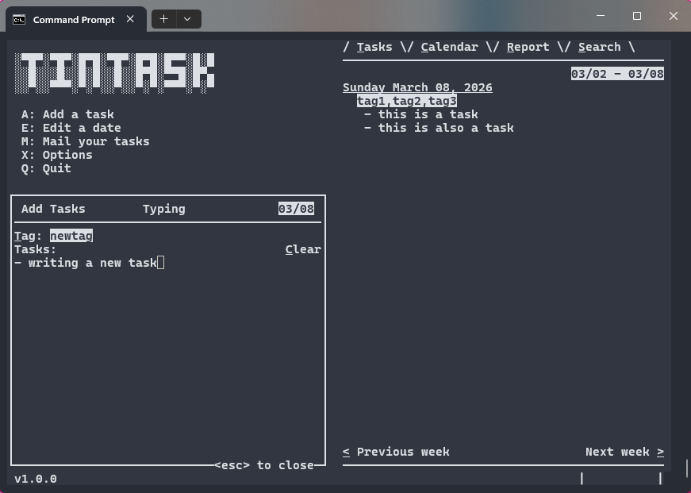
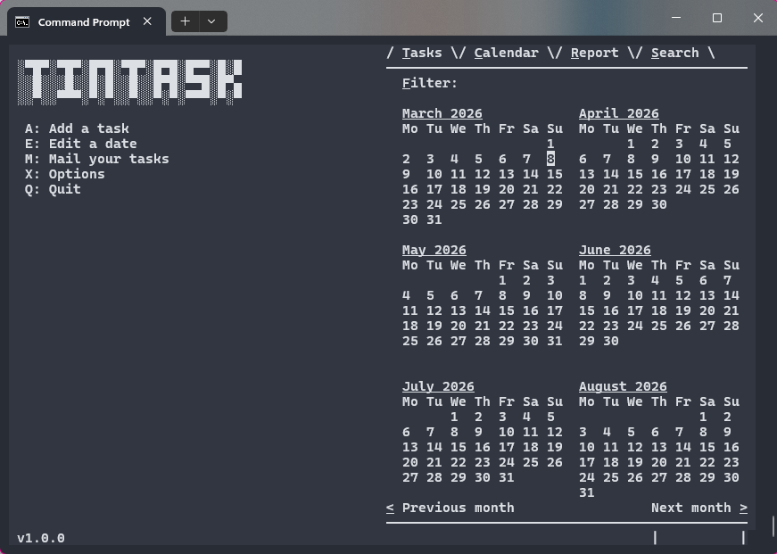
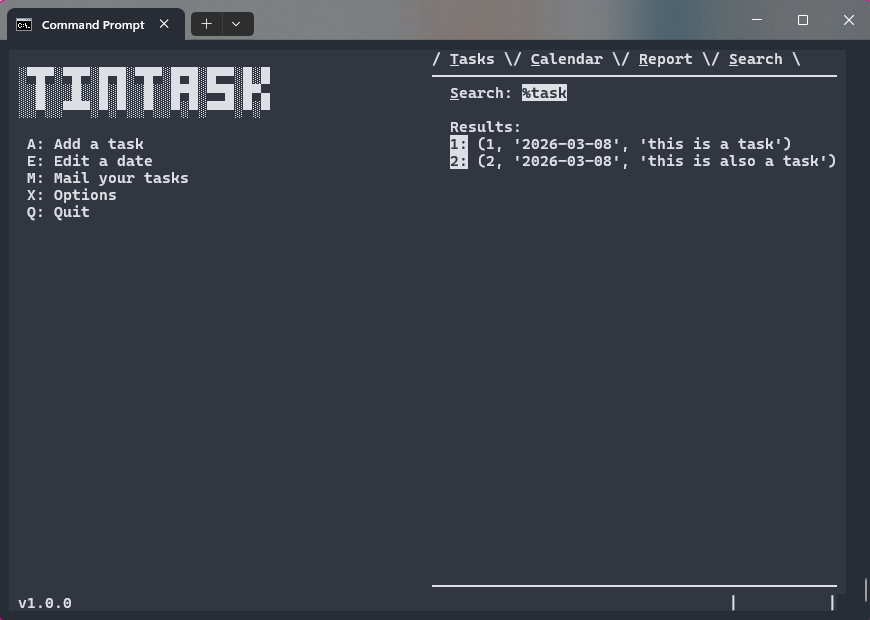
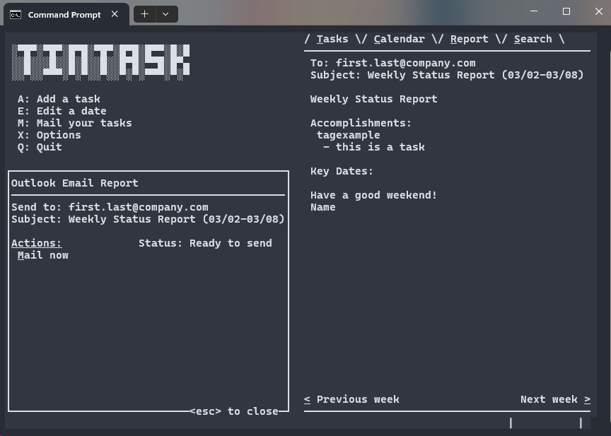

# tintask
Lightweight, command line task tracking tool

## Installation
- Download the release package
- Run `tintask.exe`
    #### Installation Options (Windows only for now)
    - **Scheduled task**: Choose when TinTask should run automatically
    - **Desktop shortcut**: Add TinTask to your desktop
    - **Start menu**: Add TinTask to your start menu
    - **Add to PATH**: Add TinTask to your path to access it in every terminal

    

### Build it Yourself
- `pyinstaller --onefile main.py --icon=images/icon.png --name=tintask.exe`

### Windows Disclaimer
- Some attributes such as underlines or bold don't show in Windows Terminal
- Switch to Windows Console Host in settings for best use

## Adding / Editing Tasks 
- Add tasks you accomplished today, with or without tags
- Modify specific dates and their respective tasks

## Calendar View
- Dates containing tasks are highlighted
- Filter by tag to only see specific categories

## Search View
- Search for key words

## Send Weekly Reports
- Configurable report format that can be automatically sent in an email

